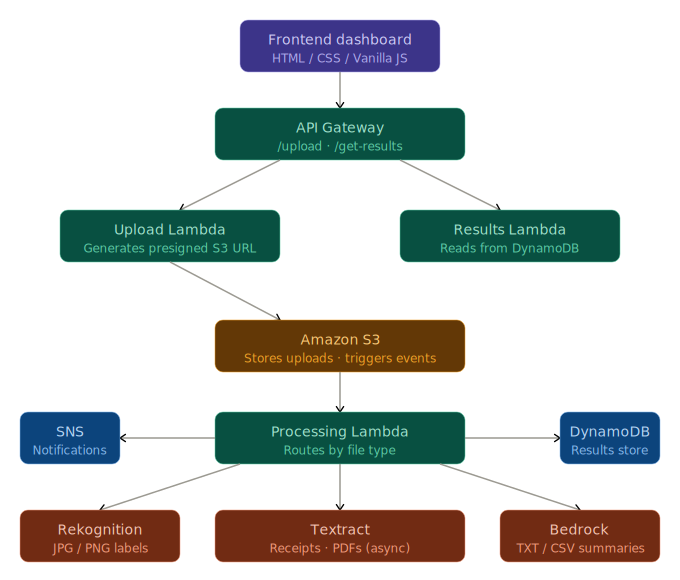

# smartpipeline-dashboard# Smart Pipeline

> Upload a file. Get AI results quickly.

Smart Pipeline is a serverless AWS application that automatically analyzes uploaded files using AI. Images, receipts, PDFs, and text files are each routed to the right AWS AI service and results are displayed in a web dashboard.

---

## Screenshots


### AWS architecture



---

## How it works

```
Upload file → S3 → Lambda → AI Service → DynamoDB → Dashboard
```

| File type | AI service used |
|---|---|
| JPG / PNG images | Amazon Rekognition |
| Receipts / document images | Amazon Textract |
| PDF files | Amazon Textract (async) |
| TXT / CSV files | Amazon Bedrock |

---

## Tech stack

- **Frontend** — HTML, CSS, Vanilla JavaScript
- **Storage** — Amazon S3
- **Compute** — AWS Lambda
- **AI** — Amazon Rekognition, Textract, Bedrock
- **Database** — Amazon DynamoDB
- **API** — Amazon API Gateway
- **Notifications** — Amazon SNS

---

## Project structure

```
smart-pipeline/
├── frontend/
│   ├── index.html
│   ├── dashboard.html
│   └── style.css
├── lambda/
│   ├── upload_lambda.py
│   └── processing_lambda.py
├── screenshots/         
└── README.md
```

---

## Setup

1. Deploy the Lambda functions to AWS
2. Create an S3 bucket and configure event triggers
3. Create a DynamoDB table named `smart-pipeline-results`
4. Set up API Gateway with `/smart-pipeline-upload` and `/smart-pipeline-get-results`
5. Update the API endpoint URLs in the frontend JavaScript
6. Open `index.html` in a browser

---

## Author

Built as a cloud engineering project demonstrating serverless architecture and AWS AI service integration.